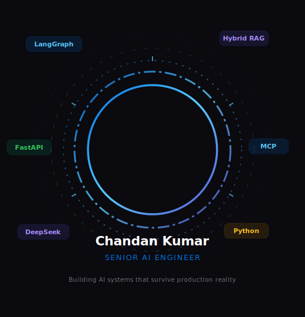

  

    
    
  

 

&nbsp;

&nbsp;

&nbsp;

&nbsp;

&nbsp;

---

### 🎙️ I explain one AI concept every day — in the simplest way possible.
**Follow along on YouTube · Instagram · X &nbsp;→&nbsp; `@aiwithrav`**

---

## ⚙️ Stack

  

---

# 🚀 Production Projects

---

## AstroIntel 360° — AI Spiritual Intelligence Platform

18+ AI agents coordinate dynamically to generate personalised structured intelligence reports across Vedic Astrology, Numerology, Palmistry, Tarot, and Vastu Shastra — in **23 Indian languages**.

<table align="center" width="100%">
<tr>
<td align="left" width="50%"></td>
<td align="left" width="50%"></td>
</tr>
<tr>
<td align="left"></td>
<td align="left"></td>
</tr>
<tr>
<td align="left"></td>
<td align="left"></td>
</tr>
<tr>
<td align="left"></td>
<td align="left"></td>
</tr>
<tr>
<td align="left"></td>
<td align="left"></td>
</tr>
<tr>
<td align="left"></td>
<td align="left"></td>
</tr>
</table>

---

## Bench Resource Optimizer — Enterprise AI HR Platform

Enterprise-grade AI system that maps bench employees to open roles using **5-layer Hybrid RAG** — with L1+L2 semantic cache, SSE streaming, circuit breaker, and LLM-as-judge guardrails. SonarQube Quality Gate PASSED.

<table align="center" width="100%">
<tr>
<td align="left" width="50%"></td>
<td align="left" width="50%"></td>
</tr>
<tr>
<td align="left"></td>
<td align="left"></td>
</tr>
<tr>
<td align="left"></td>
<td align="left"></td>
</tr>
<tr>
<td align="left"></td>
<td align="left"></td>
</tr>
<tr>
<td align="left"></td>
<td align="left"></td>
</tr>
<tr>
<td align="left"></td>
<td align="left"></td>
</tr>
<tr>
<td align="left"></td>
<td align="left"></td>
</tr>
</table>

&nbsp;

---

## RunbookAI — Enterprise IT Incident Response (RAGless)

Enterprise IT incident response engine — **zero vectors, zero embeddings, zero hallucinated commands**. Every `kubectl` command is pulled verbatim from the database. Three completely separate knowledge panels ranked by priority for every incident.

<table align="center" width="100%">
<tr>
<td align="left" width="50%"></td>
<td align="left" width="50%"></td>
</tr>
<tr>
<td align="left"></td>
<td align="left"></td>
</tr>
<tr>
<td align="left"></td>
<td align="left"></td>
</tr>
<tr>
<td align="left"></td>
<td align="left"></td>
</tr>
<tr>
<td align="left"></td>
<td align="left"></td>
</tr>
<tr>
<td align="left"></td>
<td align="left"></td>
</tr>
</table>

&nbsp;

---

## Agentic Growth OS — AI Marketing Intelligence

A LangGraph pipeline where 5 specialist agents collaborate to generate and optimise marketing campaigns — with a **learning engine** that uses past performance data to improve the next run automatically. ROI improves run over run.

<table align="center" width="100%">
<tr>
<td align="left" width="50%"></td>
<td align="left" width="50%"></td>
</tr>
<tr>
<td align="left"></td>
<td align="left"></td>
</tr>
<tr>
<td align="left"></td>
<td align="left"></td>
</tr>
<tr>
<td align="left"></td>
<td align="left"></td>
</tr>
</table>

&nbsp;

---

## Universal Agent — Plug-and-Play AI Platform

An agent platform where any application can plug in an AI agent with just a YAML file — persona, tools, behaviour, all configured at runtime. Per-agent lock/unlock for token protection. Works with any model.

<table align="center" width="100%">
<tr>
<td align="left" width="50%"></td>
<td align="left" width="50%"></td>
</tr>
<tr>
<td align="left"></td>
<td align="left"></td>
</tr>
<tr>
<td align="left"></td>
<td align="left"></td>
</tr>
<tr>
<td align="left"></td>
<td align="left"></td>
</tr>
</table>

&nbsp;

---

## 📚 Senior AI Engineer — 15-Module Study Path

 

---

## 🗂️ Repository Index

&nbsp;

&nbsp;

&nbsp;

&nbsp;

&nbsp;

&nbsp;

[-1d1d1f?style=flat-square&logo=github&logoColor=white)](https://github.com/RavSinghChandan/ai-engineer)

---

## 📡 #100DaysOfAI &nbsp;·&nbsp; Follow the journey

&nbsp;

&nbsp;

&nbsp;

---

## 🎯 Open To

&nbsp;

&nbsp;

&nbsp;

 

> *"AI is not magic. Reliable systems are engineered."*

